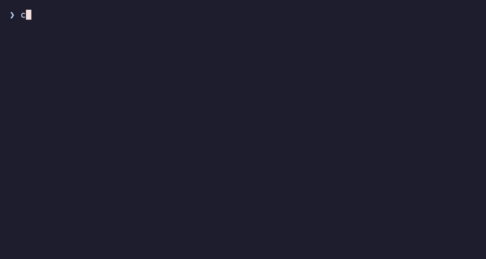

# Demos

Terminal recordings of `create-ai-native-project`, scripted with
[**VHS**](https://github.com/charmbracelet/vhs) so they're reproducible and
diff-friendly. Each `.tape` is the source; the matching `.gif` is the output.

| Demo | Tape | Output | Shows |
| --- | --- | --- | --- |
| CLI surface | [`help.tape`](./help.tape) | `help.gif` | `--version` and `--help` |
| Interactive scaffold | [`wizard.tape`](./wizard.tape) | `wizard.gif` | Full wizard: NestJS + Postgres, GitHub Actions CI, Docker — for Claude Code |




## Regenerate

Prerequisites (macOS): `brew install vhs` (pulls in `ttyd` + `ffmpeg`).

```bash
npm run build            # tapes drive the built dist/index.js
vhs demo/help.tape       # run from the repo root
vhs demo/wizard.tape
```

- [`create-ai-native-project`](./create-ai-native-project) is a thin wrapper that
  runs the locally-built `dist/index.js` under a clean name, so recordings show
  `create-ai-native-project …` instead of `node ../dist/index.js …`. Each tape
  puts it on `PATH` and scaffolds into a throwaway `mktemp -d` directory, so
  recording never touches this repo.
- The wizard tape navigates the [clack](https://github.com/bombshell-dev/clack)
  prompts by keystroke (`Down`/`Space`/`Enter`, and `y`/`n` for confirms), so if
  the registry's option **ordering** changes, its `Down N` counts may need
  updating. It assumes the template registry cache already exists
  (`~/.cache/create-ai-native-project/registry`); run the CLI once first if not.
